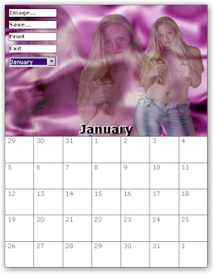



## Calendar Maker \(Print/Save\)

### Description

My wife asked me if I could make her a simple calendar maker real quick. She really just wanted blank calendars to let the children, at the school she helps out at, to color in. So I made this for her (with the ability to add images instead of being blank). It was written pretty quick and only tested on my home PC since she was going to be using it there, so there may be bugs. I just thought I would share some of my code once again here since this is not a product I will be taking much further. Some ideas to add if others wanted to is better scaling of the image in the top half, a database (or data file) of holidays to add to the calendar when it is rendered, color and font options. If anyone does add more to it, please share back on PSC. KEYWORDS: LINE, CALENDAR, PRINTER, COMMON DIALOG
 
### More Info
 

             |
---                |---
**Submitted On**   |2003-01-07 11:03:08
**By**             |[Clint LaFever](https://github.com/Planet-Source-Code/PSCIndex/blob/master/ByAuthor/clint-lafever.md)
**Level**          |Beginner
**User Rating**    |5.0 (75 globes from 15 users)
**Compatibility**  |VB 6\.0
**Category**       |[Complete Applications](https://github.com/Planet-Source-Code/PSCIndex/blob/master/ByCategory/complete-applications__1-27.md)
**World**          |[Visual Basic](https://github.com/Planet-Source-Code/PSCIndex/blob/master/ByWorld/visual-basic.md)
**Archive File**   |[Calendar\_M152541172003\.zip](https://github.com/Planet-Source-Code/clint-lafever-calendar-maker-print-save__1-42227/archive/master.zip)

